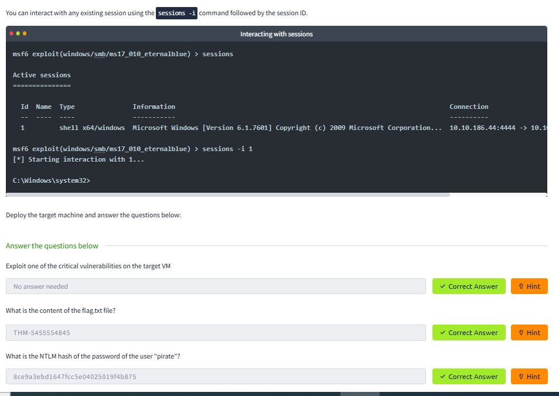

# Lab Report: Metasploit – Exploitation

## Summary of the Target
This lab demonstrates using **Metasploit for vulnerability scanning and exploitation**.

## Exploitation Steps
1. **Scanning** – Identified open ports and services.  
2. **Exploit Selection** – Chose `ms17_010_eternalblue` exploit.  
3. **Payload Execution** – Delivered reverse shell to target.  
4. **Post-Exploitation** – Gained a Meterpreter session.  

## Findings with Screenshot
- Successful exploitation of SMB vulnerability.  
- Gained shell access with **NT AUTHORITY\SYSTEM** privileges.  
- Extracted flags and password hashes.

## Remediation Advice
- Patch systems regularly (MS17-010 should be updated).  
- Disable unnecessary services like SMBv1.  
- Segment internal networks to limit exploit spread.
